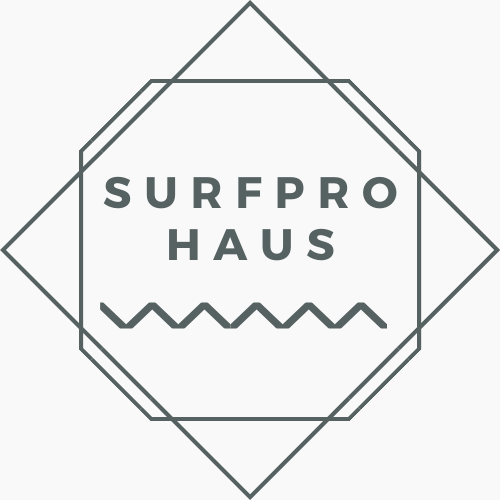
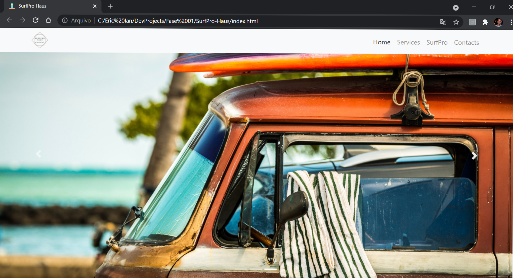
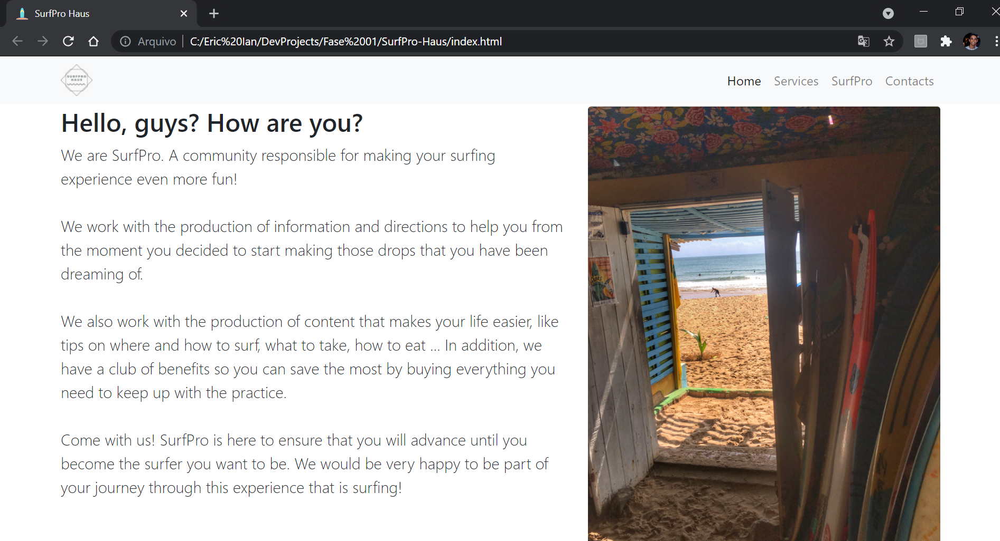

<h1 align="center">SurfPro-Haus</h1>

## Status

<h4 align="center"> 
	SurfPro-Haus - Finished! ✅
</h4>

## Description

This project is a landing page created for the selection process of Container Digital Jr, the junior company in the Systems and Digital Media course at the Federal University of Ceará.

The landing page was created for SurfPro Haus, a fictional company I imagined that provides services to surfers through the production of content and the structuring of a club of advantages in purchases. The central idea was the use of a web page formed by: navigation menu, illustrative carousel, company description, description of services, registration form, contacts and location. The company's voice seeks to be in accordance with the communicative reality of its target audience, looking for the natural informality of this reality. Users register their emails and get a mailing service according to their plans.

HTML, CSS and JavaScript were used with the support of Bootstrap. Finally, also images and icons from Unplash and Font Awesome were used respectively.

## Content

- [Description](#description)
- [Status](#status)
- [Content](#content)
- [How to use it?](#how-to-use-it)
- [Stack and Technoloy](#stack-and-technology)
- [ApplicationPhotos](#application-photos)

## How to use it?

SurfPro-Haus is a simple web page made with HTML, CSS and JS. In this sense, it is possible to access the page directly through the HMTL file, being only necessary to keep the organization of the files.

## Stack and Technology

- HMTL
- CSS (+ Bootstrap)
- JS

## Application Photos

